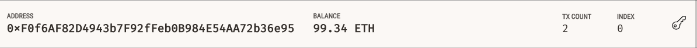
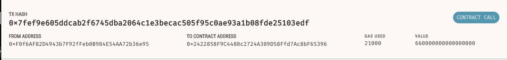

# Challenge_19

# **Fintech Finder**

This repository is a decentralized fintech finder application built on top of Ethereum. The application allows customers to find fintech professionals and then engage them for services that are paid for in Ether.

# **Contributors**

Developed by:

Matthew Crater

[Linked In](https://www.linkedin.com/in/matt-crater/)

---

# **License**

MIT